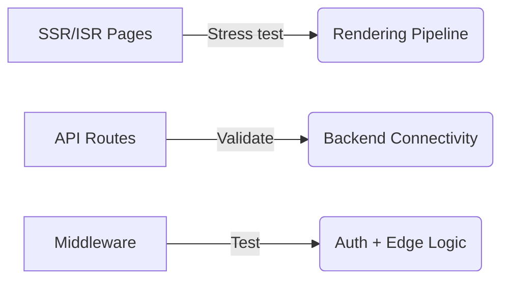
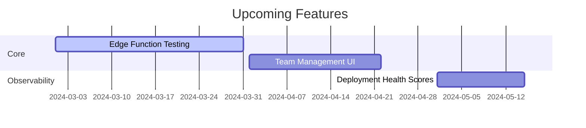

# 🌟 NextDeploy Frontend

**A Production-Ready UI for NextDeploy**  
Built with **Next.js**, designed for scale, and deployed with the same engine it helps validate.

Welcome to the frontend that powers NextDeploy's dashboard, documentation, and—most importantly—**stresstests our platform in real-world conditions**.

---

## ✨ Why This Exists

This isn't just another admin panel. It's a **living benchmark** for NextDeploy itself, ensuring:

✅ **Real-world testing** of SSR, ISR, API routes, and middleware  
✅ **Observability** into deployment behavior and edge cases  
✅ **Minimal, maintainable UI** without unnecessary abstractions  
✅ **Documentation** that stays in sync with actual platform behavior

We built this to _find cracks before our users do_.

---

## 🛠 Tech Stack

| Technology           | Purpose                         | Status        |
| -------------------- | ------------------------------- | ------------- |
| Next.js (App Router) | Core framework with RSC support | ✅ Production |
| Tailwind CSS         | Utility-first styling           | ✅ Stable     |
| Websockets           | Real-time log streaming         | 🔧 Improving  |
| Custom Auth          | Route protection + RBAC         | ✅ Stable     |
| PostgreSQL (Prisma)  | Persistent state where needed   | ⚡ Optional   |

**Key Differentiator:**  
This app is deployed _using NextDeploy itself_—eating our own dogfood from day one.

---

## 🎯 Key Features

### 🧭 Dashboard

- Deployment management
- Real-time logs via WebSocket
- Environment configuration

### 📚 Documentation

- Always up-to-date with platform capabilities
- Interactive examples where possible

### 🧪 Platform Validation

Every page tests critical Next.js features:



---

## 🏗 Design Principles

1. **Production Behavior First**  
   If it doesn't work deployed, it doesn't work.

2. **Minimal Abstraction**  
   Clear code > clever patterns.

3. **UI as Instrumentation**  
   Every component surfaces system behavior.

4. **Progressive Enhancement**  
   Core functions work without JavaScript.

---

## 💻 Getting Started

```bash
pnpm install
pnpm dev
```

**Key Routes to Explore:**

- `/dashboard` - Protected management UI
- `/docs` - Public documentation
- `/api/logs` - Real backend-connected endpoint

**Deploy It Yourself:**

```bash
nextdeploy build && nextdeploy ship
```

---

## 🤝 How to Contribute

We welcome contributors who:

- Build UIs that reveal system behavior
- Care about production-grade Next.js patterns
- Prefer simple solutions to complex frameworks

**Good First Issues:**

- Improving error boundaries
- Enhancing real-time status indicators
- Adding new platform validation tests

**Before Submitting:**

- [ ] Does this improve observability?
- [ ] Is the code maintainable at scale?
- [ ] Will it fail clearly if the backend breaks?

---

## 🗺 Roadmap



---

## 📚 Learn More

- [NextDeploy CLI](https://github.com/aynaash/nextdeploy) - The deployment engine
- [Architecture Decisions](/.github/ARCHITECTURE.md) - Why we built it this way
- [Contributing Guide](/.github/CONTRIBUTING.md) - Collaboration standards

---

## 🌱 Final Thought

This project embodies our belief that **frontend infrastructure matters**. It's not just about pixels—it's about creating interfaces that make complex systems understandable, reliable, and delightful to use.

_"The interface is the system."_ — Let's build it right.

---
