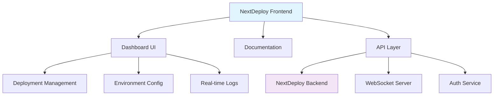
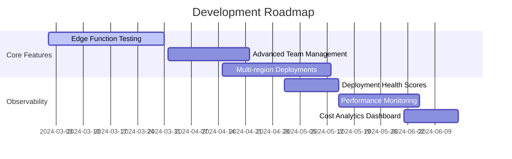

# NextDeploy Frontend

> **A production-ready UI that validates NextDeploy while serving real users**

[](https://nextdeploy.one) [](https://nextjs.org/) [](https://nextdeploy.one)

---

## Overview

NextDeploy Frontend is more than a dashboard—it's a **living stress test** for our deployment platform. Every page load, API call, and user interaction validates NextDeploy's capabilities in real-world conditions.

### Why This Approach?

- **🔍 Real-world validation** - Find edge cases before users do
- **📊 Production observability** - Monitor actual deployment behavior  
- **🚀 Dogfooding excellence** - We deploy with what we build
- **📚 Living documentation** - UI that reflects current platform state

---

## Quick Start

### Prerequisites
- Node.js 18+ 
- pnpm (recommended)

### Installation

```bash
# Clone and install
git clone https://github.com/aynaash/nextdeploy-frontend
cd nextdeploy-frontend
pnpm install

# Start development server
pnpm dev
```

### Deploy with NextDeploy

```bash
# Install NextDeploy CLI
curl -fsSL https://nextdeploy.one/install.sh | sh

# Deploy this frontend
nextdeploy build && nextdeploy ship
```

---

## Architecture

### Tech Stack

| Component | Technology | Purpose | Status |
|-----------|------------|---------|---------|
| **Framework** | Next.js 14 (App Router) | SSR/ISR with React Server Components | 🟢 Stable |
| **Styling** | Tailwind CSS | Utility-first responsive design | 🟢 Stable |
| **Database** | PostgreSQL + Drizzle | Optional persistent state | 🟡 Optional |
| **Real-time** | WebSockets | Live deployment logs | 🟡 Improving |
| **Auth** | Custom RBAC | Route protection & permissions | 🟢 Stable |

### System Design



---

## Key Features

### 🎛️ Dashboard
- **Deployment Pipeline** - Visual deployment status and controls
- **Environment Management** - Configuration for dev/staging/production
- **Real-time Monitoring** - Live logs and system health
- **Team Collaboration** - Multi-user access with role-based permissions

### 📖 Documentation Hub
- **Interactive Examples** - Runnable code samples
- **API Reference** - Auto-generated from OpenAPI specs
- **Best Practices** - Battle-tested deployment patterns
- **Troubleshooting** - Common issues and solutions

### 🧪 Platform Validation
Every component tests critical Next.js features in production:

- **SSR/ISR Pages** → Rendering pipeline stress tests
- **API Routes** → Backend connectivity validation  
- **Middleware** → Auth and edge logic verification
- **WebSocket Connections** → Real-time communication stability

---

## Project Structure

```
nextdeploy-frontend/
├── app/                    # Next.js App Router pages
│   ├── dashboard/         # Protected dashboard routes
│   ├── docs/              # Documentation pages
│   └── api/               # API route handlers
├── components/            # Reusable UI components
│   ├── ui/                # Base components (buttons, inputs)
│   ├── dashboard/         # Dashboard-specific components
│   └── docs/              # Documentation components  
├── lib/                   # Utilities and configurations
├── hooks/                 # Custom React hooks
└── types/                 # TypeScript definitions
```

---

## Development

### Core Routes

| Route | Purpose | Auth Required |
|-------|---------|---------------|
| `/` | Landing page with platform overview | No |
| `/dashboard` | Main deployment interface | Yes |
| `/docs` | Public documentation | No |
| `/api/deployments` | Deployment management API | Yes |
| `/api/logs` | Real-time log streaming | Yes |

### Local Development

```bash
# Start with hot reload
pnpm dev

# Run with production build locally
pnpm build && pnpm start

# Run tests
pnpm test

# Type checking
pnpm type-check
```

### Environment Variables

```bash
# Required
NEXTDEPLOY_API_URL=https://api.nextdeploy.one
NEXTAUTH_SECRET=your-secret-key

# Optional  
DATABASE_URL=postgresql://...
WEBSOCKET_URL=wss://ws.nextdeploy.one
```

---

## Installation Options

### NextDeploy CLI

Choose your platform:

#### Linux
```bash
curl -fsSL https://nextdeploy.one/linux-cli.sh | sh
```

#### macOS
```bash
curl -fsSL https://nextdeploy.one/mac-cli.sh | sh
```

#### Windows (PowerShell)
```powershell
# Run as Administrator
iwr -useb https://nextdeploy.one/windows.ps1 | iex
```

### NextDeploy Daemon (Linux/macOS)
```bash
curl -fsSL https://nextdeploy.one/nextdeployd.sh | sh
```

> 💡 **Pro tip**: Use versioned installs (`/install/v0.1.0.sh`) for reproducible environments

---

## Contributing

We welcome contributions that improve platform observability and user experience.

### Good First Issues
- [ ] Enhance error boundary coverage
- [ ] Add deployment health indicators  
- [ ] Improve real-time status components
- [ ] Create additional platform validation tests

### Contribution Guidelines

1. **Fork & Branch** - Create feature branches from `main`
2. **Test Production Scenarios** - Ensure changes work when deployed
3. **Maintain Simplicity** - Prefer clear code over clever abstractions
4. **Add Observability** - Components should reveal system behavior

### Pull Request Checklist

- [ ] Does this improve system observability?
- [ ] Is the code maintainable at scale?
- [ ] Will failures be clear and actionable?
- [ ] Have you tested the deployed version?

---

## Roadmap



### Upcoming Features
- **🌐 Edge Function Testing** - Validate serverless functions across regions
- **👥 Team Management 2.0** - Advanced RBAC and collaboration tools
- **📊 Health Scoring** - Automated deployment quality assessment
- **💰 Cost Monitoring** - Resource usage tracking and optimization

---

## Resources

### Documentation
- [NextDeploy CLI Repository](https://github.com/aynaash/nextdeploy) - Core deployment engine
- [Architecture Decisions](/.github/ARCHITECTURE.md) - Technical design choices
- [API Documentation](https://docs.nextdeploy.one/api) - Complete API reference

### Community
- [Contributing Guide](/.github/CONTRIBUTING.md) - Detailed contribution workflow
- [Issues](https://github.com/aynaash/nextdeploy-frontend/issues) - Bug reports and feature requests
- [Discussions](https://github.com/aynaash/nextdeploy-frontend/discussions) - Community Q&A

---

## Philosophy

> **"The interface is the system"**

We believe frontend infrastructure isn't just about pixels—it's about creating interfaces that make complex distributed systems understandable, reliable, and delightful to use.

This project embodies our commitment to:
- **Production-first development** - If it doesn't work deployed, it doesn't work
- **Observability through UI** - Every component reveals system state
- **Simplicity over cleverness** - Clear solutions that scale with teams
- **Continuous validation** - Always testing our own platform

---

<div align="center">

**Ready to deploy?**

[Get Started](https://nextdeploy.one/docs/quickstart) • [View Dashboard](https://nextdeploy.one/dashboard) • [Join Community](https://github.com/aynaash/nextdeploy-frontend/discussions)

</div>
